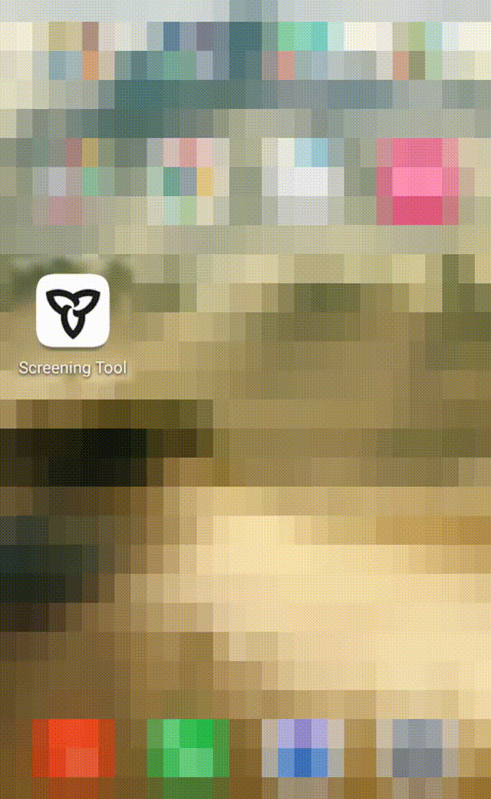
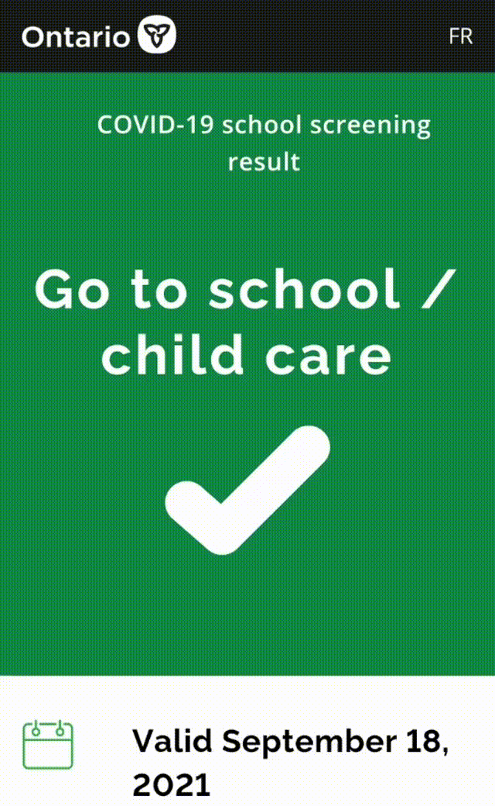

# Ontario Auto Screening (Android)

## How to Use

**By comfirming the following eight statements with one click at the start up of the app, it will show you the Ontario Daily Screening result directly without anymore clickings. You are responsible for the confirmation and the information you provided.**

1. I am taking this screening as a student/child.

2. In the last 14 days, I have NOT travelled outside of Canada.

3. There is NO doctor, health care provider, or public health unit has told me that I should currently be isolating (staying at home).

4. In the last 10 days, I have NOT been identified as a “close contact” of someone who currently has COVID-19.

5. In the last 10 days, I have NOT received a COVID Alert exposure notification on my cell phone.

6. I am NOT currently experiencing any of these symptoms: fever and/or chills, cough or barking cough (croup), shortness of breath, decrease or loss of taste or smell, nausea, vomiting, and/or diarrhea.

7. There is NOBODY I live with currently experiencing any new COVID-19 symptoms and/or waiting for test results after experiencing symptoms.

8. In the last 10 days, I have NOT been tested positive on a rapid antigen test or home-based self-testing kit.

## App Demos

- App Start

- Web Page

## Thanks for the following projects

+ covid-19-screening-tools

*If you think this project is helpful, please give me a star for support, thanks!*
